# Automating Policy and Dynamic Group Monitoring in Oracle Cloud Infrastructure

## Introduction

As OCI environments grow, it becomes harder to keep track of how many **IAM policies and dynamic groups** exist across different compartments and domains. While **Oracle Cloud Infrastructure** provides powerful IAM controls, there isn’t a single place to get a consolidated view of policies, statements, or dynamic group usage across the tenancy.

This guide walks you through automating the **monitoring of IAM policies and dynamic groups** in **OCI** using a **Function** and **custom dashboard**. The goal is not to analyze or validate policy configurations, but to provide visibility into numbers and distribution—such as how many policies, statements, or dynamic groups exist and where they are defined. By the end, you’ll have an automated setup that collects this data, publishes it as custom metrics, and visualizes it through dashboards for easy tracking and reporting.

## Objectives

- Setup OCI Policy and Dynamic Groups monitoring in the OCI Tenancy.
	
	- Deploy **OCI Policy and Dynamic Group Monitoring Function** in the OCI Tenancy via Cloud Shell.
	
	- Define appropriate policies for the function execution and optionally enable logging for troubleshooting.
  
	- After the successful manual execution of the Function, configure a resource scheduler for automated function execution based on time interval.
  
	-	Deploy the Dashboard to have a good visibility and analysis of the data collected. 
  

### Prerequisites

- Access to an OCI tenancy with Admin Access.

- VCN with Public subnet 

- Auth Token for the Admin user with which you would be deploying the Function.

- A private OCI container repository for storing the image after it is created.

## Task 1: Create the Function from the OCI Console


The first step is to go ahead and create the function from the console for our OCI Policy and Dynamic Group monitoring.

1. From the OCI console, navigate to **Developer Service** then to **Functions** and Click on **Create Function**

	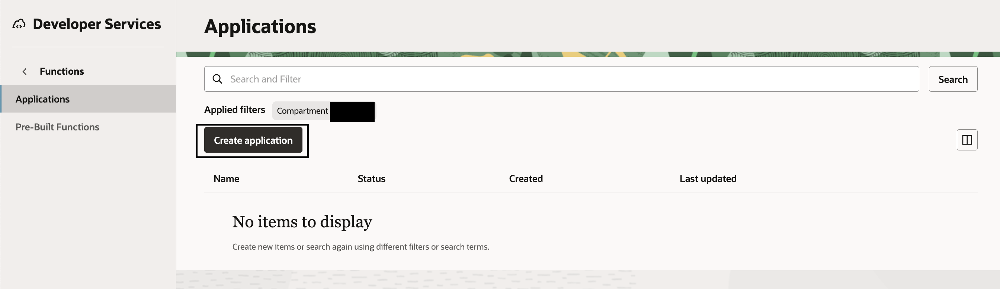

2. Now provide the details related to your existing **VCN with Public Subnet**, click on **Create**

	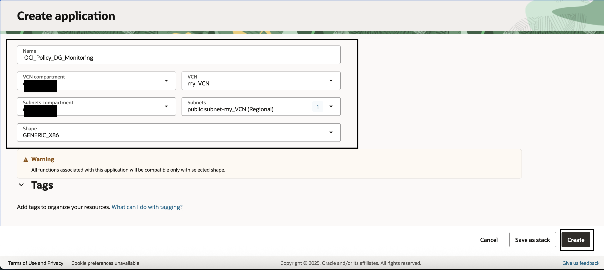

3. Navigate to **Configuration** tab, click on **Manage Configurations** and add "**Key** - **Value**" pairs as mentioned below. **Note** - Update the values for **Policy, Policy Statement and Dynamic Groups** if not the **Default** values will be considered. 

	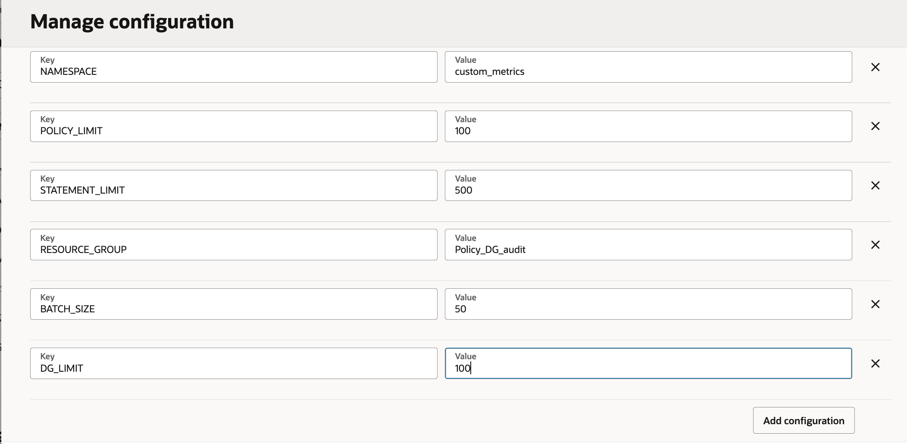

4. Create a **OCI Private Repository** if you don’t already have one for the **Function**. Navigate to **Developer Services** then to **Container Registry** and click on **Create Repository**. On the pop-up provide the required details and click **Create**. **Note** - The access type should be **Private**

	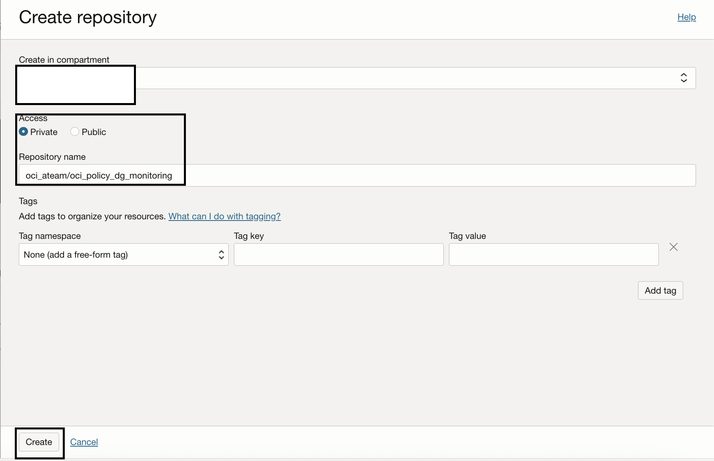

5. Now, from the function **details** tab, under **Getting Started** click on **View Guide** for **Cloud Shell Setup**

	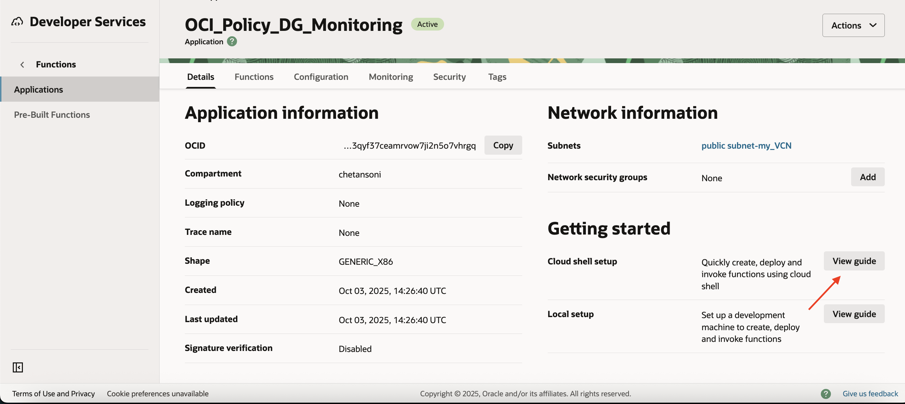

6. Launch the **Cloud Shell** and follow the **Guide**, **Generate OAuth Token** if you don’t already have one. Go on execute these steps upto step **7** from the guide. Then for the last step, use the below command to create application with Python as the Runtime

	```fn init -runtime python oci-dg-monitoring```

	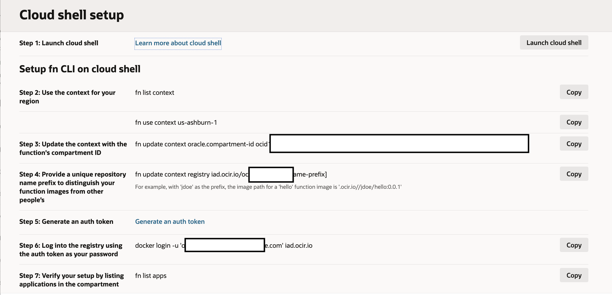

	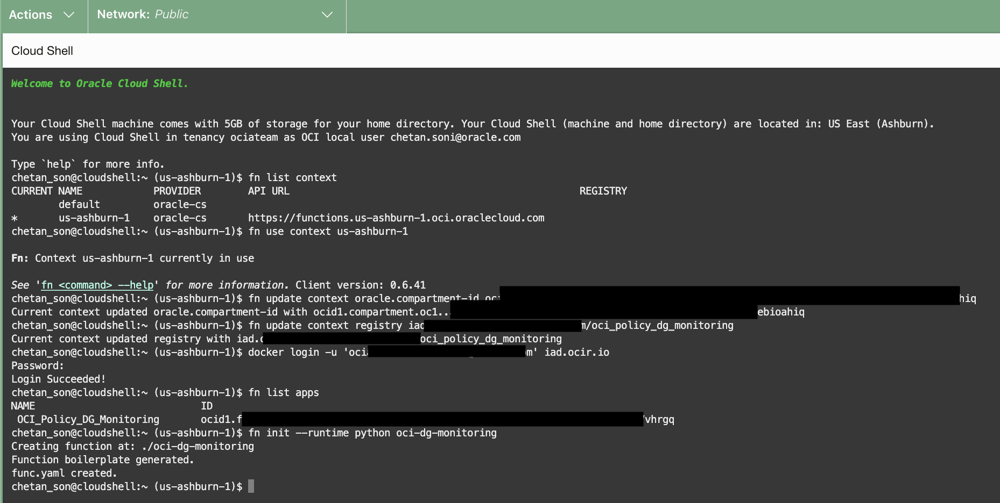


7. Navigate to the created folder for your **Function**, you should see **func.py**, **func.yaml** and **requirements.txt** files created. Replace those files with the files on this repository.

### Task 2: Setup the Dynamic Group and Policies for Function Execution.

In this option, we are focusing on setting up the **Dynamic Group** and define the necessary policies to ensure our **Function** has the required **IAM Privileges**. 

1. Navigate to **Identity and Security**, **Domains**, select your domain, and then **Click** on the **Dynamic Groups** tab.

   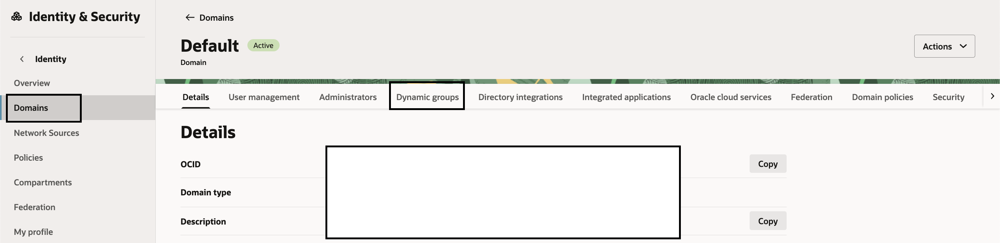

	> **Note:** We are using **Default** Domain here but you can choose any other domain of your choice.

2. Click **Create Dynamic Group** and details as below. On the matching rule, add the below rule and add the **OCID** of the compartment where your function is existing.

	```
	ALL {resource.type = 'fnfunc', resource.compartment.id = 'ocid1.compartment.oc1..aaaaaaaabisgr2xxxxxxxxxxxxx'}
	```

   

3. Now navigate to **Identity and Security** and then to **Policies** and **Click** **Create Policy**. The policy needs to be on the **root** compartment with the below **Policy Statements** added.

	```
	Allow dynamic-group 'domain_name'/'Dynamic_Group_name' to manage functions-family in compartment compartment_name
	Allow dynamic-group 'domain_name'/'Dynamic_Group_name' to use log-groups in compartment compartment_name
	Allow dynamic-group 'domain_name'/'Dynamic_Group_name' to use metrics in tenancy
	Allow dynamic-group 'domain_name'/'Dynamic_Group_name' to read all-resources in tenancy
	Allow dynamic-group 'domain_name'/'Dynamic_Group_name' to manage resource-schedule-family in compartment compartment_name
	```

	**Note-** The last policy statement is for automated executing of the **Function** via **Resource scheduler**, omit it if you want to keep the **Function Invoke** manual.


## Task 3: Deploy & Invoke the Function

1. Navigate to the **Cloud Shell** session, and now execute the below command to **Deploy** the function. It should take 3-4 mins to **Deploy**.

	```
	fn deploy --app " OCI Policy_DG_Monitoring"
	```

   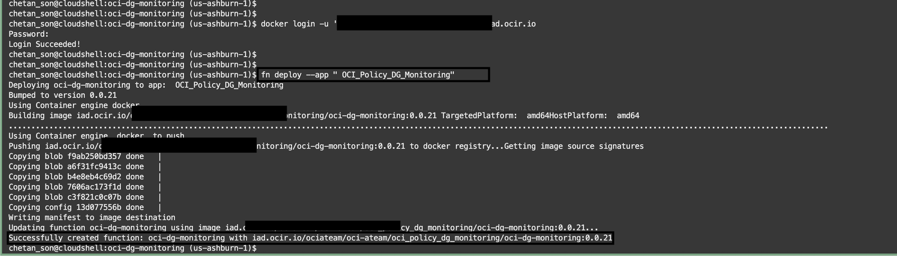

2. After the **Deploy** is successful, you can check if the **Function** tab on the **Application** has an entry by the name **oci-dg-monitoring**.

   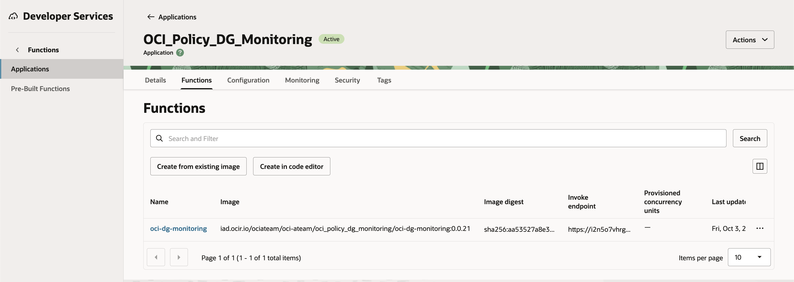

3. Now enable the **Logging** for the Function and create a new **Log Group** for **Function Invocation** logs. 

	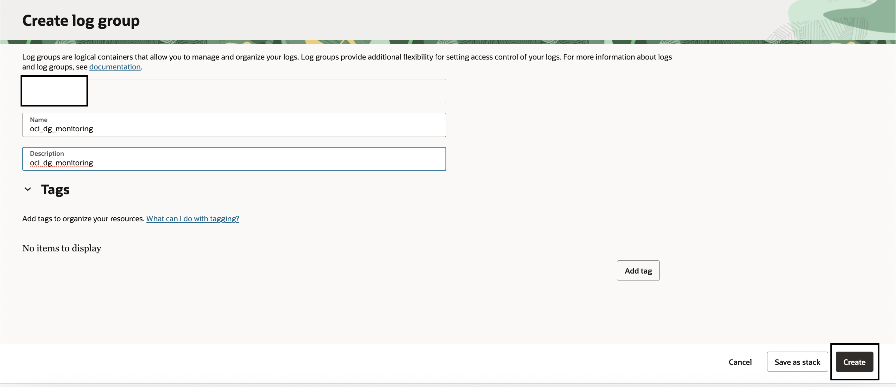

	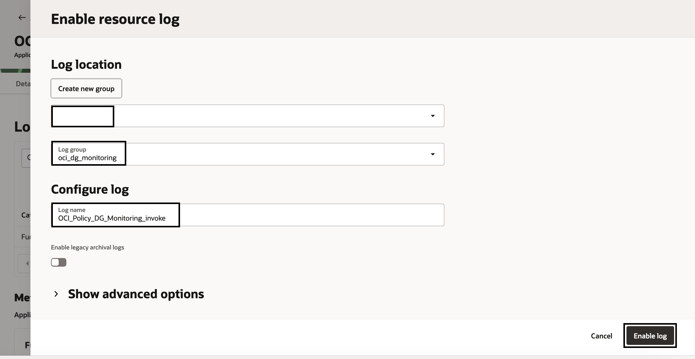

4. With all these configurations done, we are now ready to **Invoke** our Function. Go to the **Cloud Shell**, and execute the below command after navigating into our **Function Folder**.

	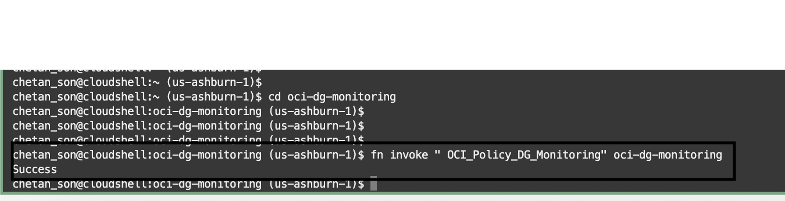

5. Now, let us ensure we can see the **Custom Namespace** and **Metrics** under the **Resource Group** via OCI console. Navigate to **Observability & Management** then to **Metrics Explorer** under **Monitoring**. Here in the query section, select **root** for compartment. You should get **custom_metrics** under **Namespace**, and **Policy_DG_audit** under **Resource Group**.

	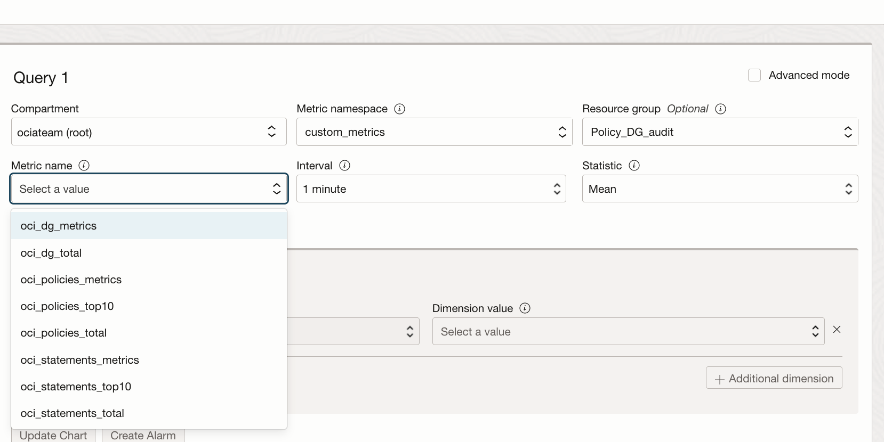	

## Task 4: Visualization via Dashboard

After the data is collected, the next step is to get this data to **visualization** via **OCI Dashboard**. The **Git Repo** also has a pre build code for creating this **Dashboard**. The code will create a **Dashboard Group** under **root** compartment by the name **IAM_Policy_DG_Group**. The code will then create a dashboard under this group by the name **OCI_IAM_Policy_DG_Dashboard**.


1. Copy the **OCI_Policy_DG_Audit_Dashboard.py**, file from this repository to your OCI **Cloud Shell**. 
 
2. Execute the **OCI_Policy_DG_Audit_Dashboard.py** with the help of below command.
   
   ```
   python OCI_Policy_DG_Audit_Dashboard.py
   ```
3. Navigate to **Dashboards** under **Home** in **OCI Console**, then to **Manage Dashboards**, select **IAM_Policy_DG_Group** and then click on **OCI_IAM_Policy_DG_Dashboard**. You should see dashboard with **Widget** as below.


	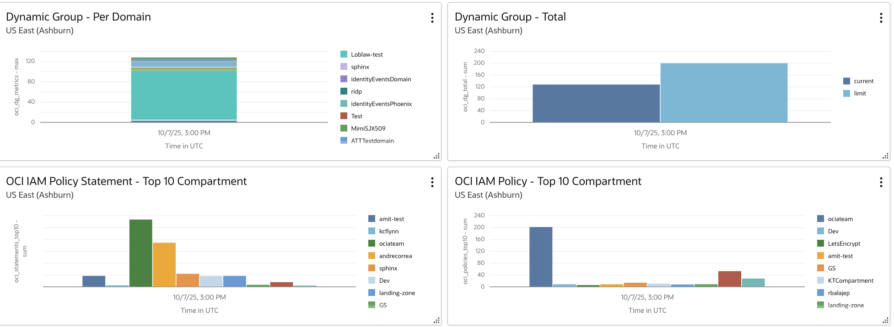

	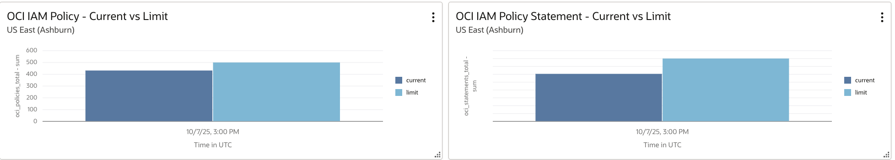


## Task 5: Optional - Scheduling the execution of the function via Resource scheduler

In this step, we take the invocation of the Function from manual to an automated schedule-based approach via **OCI Resource scheduler**.

1. Navigate to **Governance & Administration**, under **Resource scheduler** click on **Schedules**. Select your compartment and then click **Create a Schedule**.

   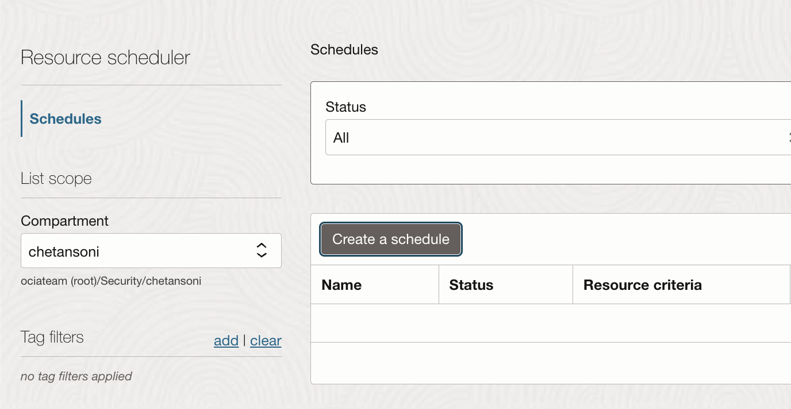

2. Fill in the details as mentioned below on the **Basic Information** page and then click on **Next**.

	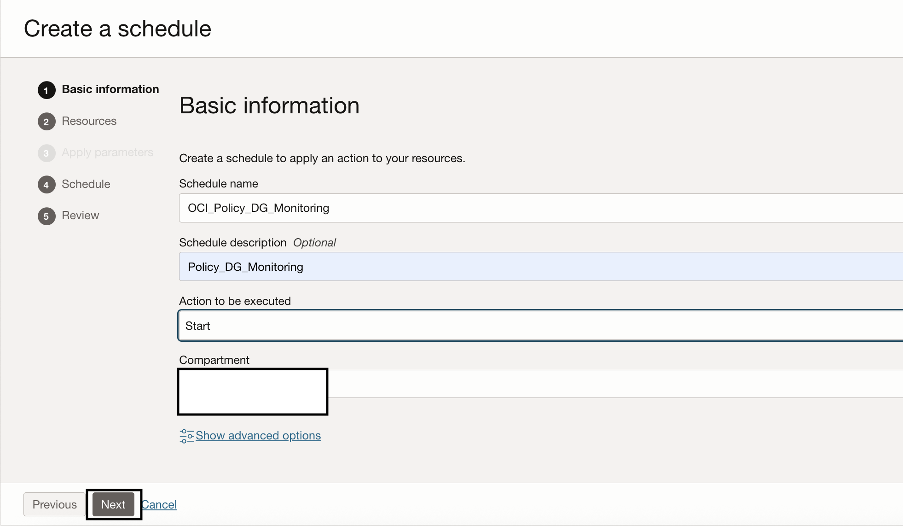

3. On the **Resources** page, search for the **Function** **oci-dg-monitoring**, select it and click on **Next**.

	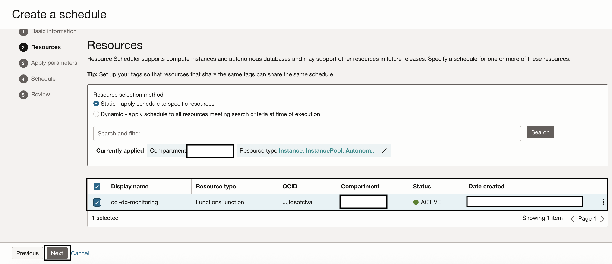

4. On the **Apply Parameters** page, just select **Function** **oci-dg-monitoring**, and click on **Next**.

	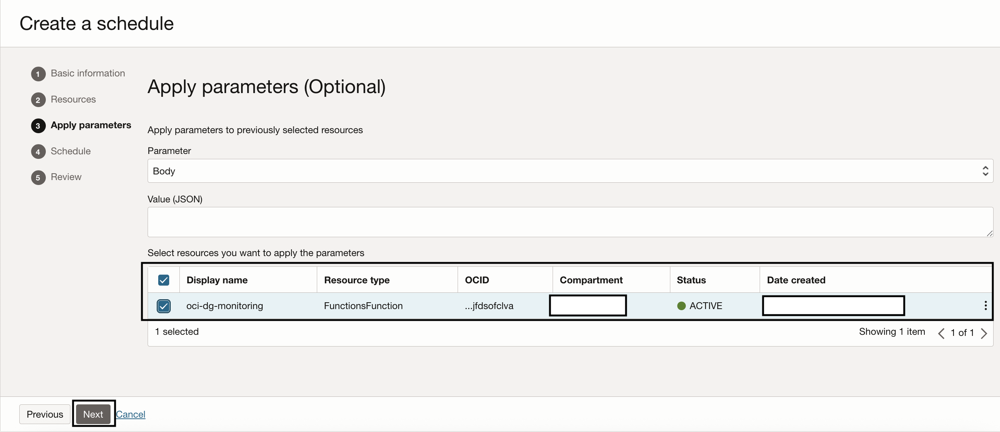

5. On the **Schedule** page, select **Interval** as **Weekly**, and select the **Frequency** under select a future time since we need one more step before the scheduled execution can run and then click on **Next**.

	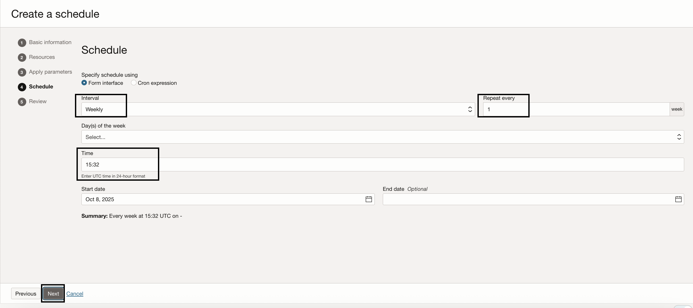

6. On the **Review** page, check if everything is as expected and then click on **Create Schedule**.

	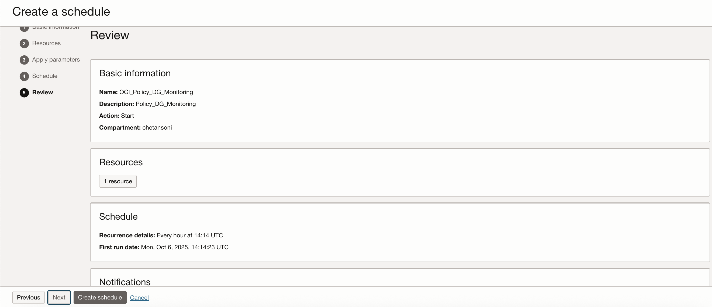		

7. To ensure the **Resource scheduler** is able to invoke the function and run without errors, update the **Dynamic Group** created in **Task 2** and add one more matching rule to it. And if you had not added the policies in the previous task, then add it.

	```
	ALL {resource.type='resourceschedule', resource.id='ocid1.resourceschedule.oc1.iad.amaxxxxxxxxxxxxxxxxxxx'}
	```			

7. Monitor the **scheduler** and check if the executions are getting successful responses also, check the **Dashboard** for latest values via **Widgets**

**Note-** You can also set up **Alarms** to get prompt notifications based on conditions through **OCI Notifications** service
   
## Related Links

- [Custom Metrics](https://docs.oracle.com/en-us/iaas/application-performance-monitoring/doc/configure-custom-metric.html#APMGN-GUID-B1BCF6A5-B117-43D0-AE36-3F97D9507615)

- [Publishing Custom Metrics Using the API](https://docs.oracle.com/en-us/iaas/Content/Monitoring/Tasks/publishingcustommetrics.htm).

- [Creating a Resource Scheduler Schedule](https://docs.oracle.com/en-us/iaas/Content/resource-scheduler/tasks/create-manage.htm).

- [IdentityDomainsClient](https://docs.oracle.com/en-us/iaas/tools/python/2.161.0/api/identity_domains/client/oci.identity_domains.IdentityDomainsClient.html#identitydomainsclient).

- [IdentityClient](https://docs.oracle.com/en-us/iaas/tools/python/2.161.0/api/identity/client/oci.identity.IdentityClient.html).

- [API Reference](https://docs.oracle.com/en-us/iaas/tools/python/2.161.0/api/landing.html).


## Acknowledgments

- **Author** - Chetan Soni (Senior Cloud Engineer)
